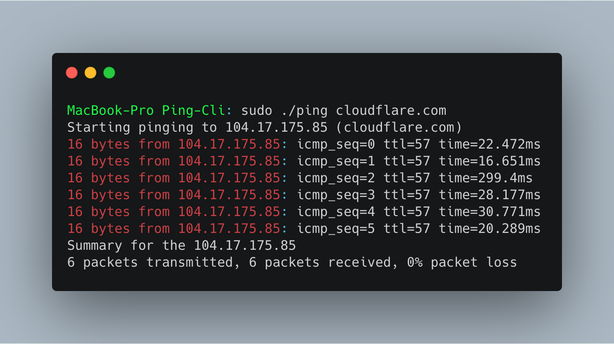
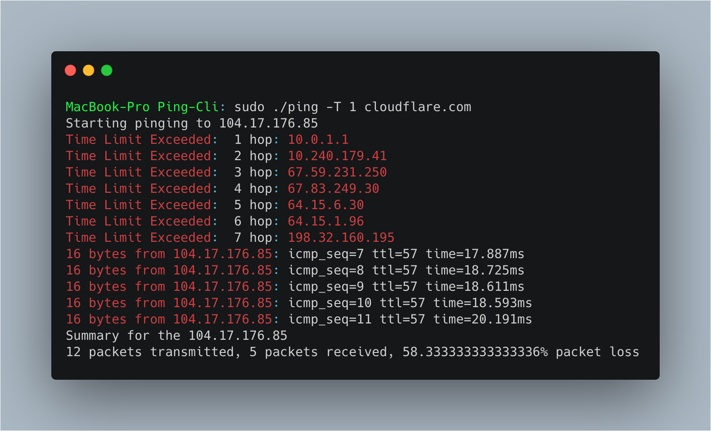

# Ping-Cli

A simple ICMP Echo implementation, based on golang.org/x/net/icmp.

## Feature: 
* IPv4 and IPv6 support
* Arguement to set TTL and see Time Limit Excedded Messages

It sends ICMP packet(s) and waits for a response. When it's finished, it prints the summary based
of packet sent, received and lost.

## Usage:

### Installation
For installing you only need three external libraries:
* "golang.org/x/net/icmp"
* "golang.org/x/net/ipv4"
* "golang.org/x/net/ipv6"

You can download these using `go get $name_of_library$`

### Building

`./ping hostname` or `sudo ./ping hostname`

This command will create a binary executable file: Using this cli is very easy:

### Arguements 
Usage:

	ping [-i interval] [-T TTL Limit][--p] host
	
	example pinging to cloudflare.com:
	./ping www.cloudflare.com

	# For privelage use "--p" flag:
	sudo ./ping --p www.cloudflare.com

	# For Interval use "-p" flag:
	sudo ./ping -i 500ms www.cloudflare.com

	## For TTL use "-T" flag:
	sudo ./ping -T 10 www.cloudflare.com

	Note: Default TTL is set to 50, if IMCP Time Limit Exceeded Message is Received, it will be printed and TTL will be increased by 1 until first Echo Request is received.

	# By default interval is set = 1ms

### Structure of Code:
Root Directory: "Ping-Cli"
	Main File: `ping.go:` Consits of `main` package and cli code

	pinger: custome build ping package
		/pinger.go: This is where all the code for ping exists.

##Troubleshoot:

As the net packages is sending an "unprivileged" ping via UDP, it is recommended to have root privelages
"sudo ./ping cloudflare.com"
<<<<<<< HEAD:Readme.md

I have also hosted the code on my github repo: https://github.com/mohit8935/Simple-Go-Ping

